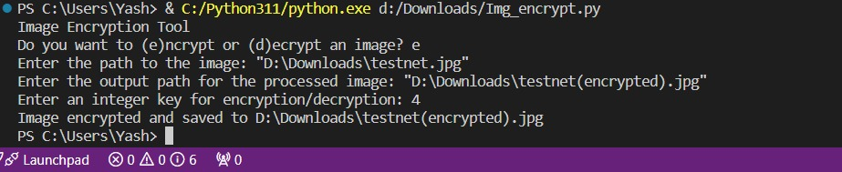

# Pixel Manipulation

## Problem Statement

Develop a simple image encryption tool using pixel manipulation. You can perform operations like swapping pixel values or applying a basic mathematical operation to each pixel. Allow users to encrypt and decrypt images.

## Working of the Project

The Pixel Manipulation project provides a tool for encrypting and decrypting images using pixel manipulation techniques. Users can choose between encryption and decryption modes and provide a key for processing the images. During encryption, pixel values are modified based on the selected method, and during decryption, the process is reversed to restore the original image.

### Features
- **Encryption**: Encrypt images using pixel manipulation techniques.
- **Decryption**: Decrypt encrypted images using the provided key.
- **Key Input**: Allow users to input an integer key for encryption and decryption.
- **Pixel Manipulation**: Apply pixel manipulation operations such as swapping pixel values or adding/subtracting key values.

### Pixel Manipulation Techniques
- **Swapping Pixels**: The `swap_pixels` function swaps adjacent pixels in pairs horizontally.
- **Adding Key to Pixel Values**: During encryption, we add the key value to each pixel's RGB values, and take modulo 256 to ensure the pixel values stay within the valid range (0-255).
- **Subtracting Key from Pixel Values**: During decryption, we subtract the key value from each pixel's RGB values, and take modulo 256 to handle wrap-around.

### Follow the prompts to provide the necessary information:

- Whether to encrypt or decrypt an image.
- The path to the image file.
- The output path for the processed image.
- An integer key for encryption/decryption.

#### Encrypt an Image:

Run the script and choose the encryption option. Provide the path to an input image, output path for the encrypted image, and a key.

#### Compare the Original and Encrypted Images:

Open both the original and encrypted images in an image viewer. You should see a significant difference between them due to the pixel value changes and swapping.

### Image Proofs

- Terminal Screenshot:
  
- Original vs. Encrypted Image Comparison:
  

### LinkedIn

[LinkedIn](https://linkedin.com/in/yash-borkar-048094225)

### Running the Application

Run the script `Img_encrypt.py` using Python:
```bash
python Img_encrypt.py

